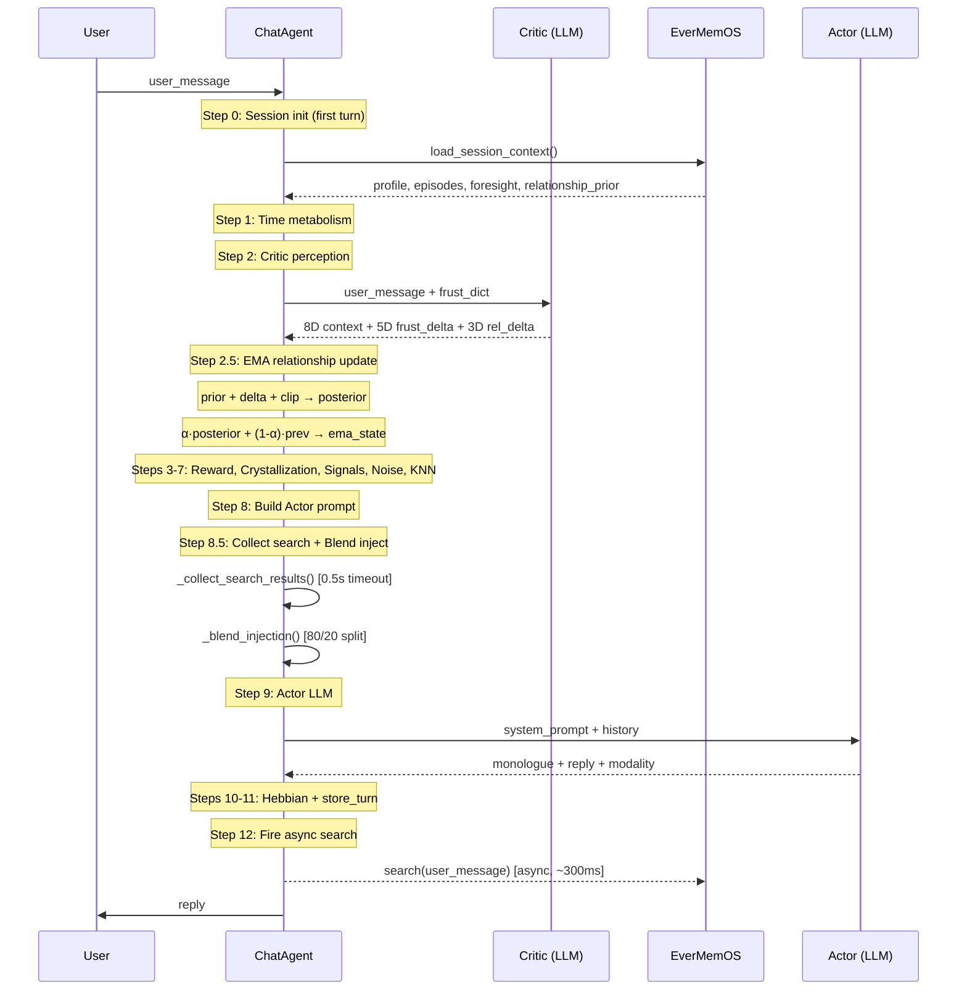

# V10 × EverMemOS 涌现优化 — 最终总结

> **分支**: `feature/evermemos-clean` · **9 commits** · **3 files** · 2026-02-26

---

## Commit 全景

| # | Hash | 类型 | 描述 |
|:--|:-----|:-----|:-----|
| 1 | `596ef5c` | P0 fix | signal double-computation + session key mismatch |
| 2 | `f060e8d` | Phase 1 | semi-emergent relationship 4D + sleeping dims activation |
| 3 | `b99f110` | docs | fix misleading docstring |
| 4 | `b54fd2f` | fix | Critic 8D/12D separation + _last_critic ordering |
| 5 | `b692668` | Phase 2 | crystallization composite score + dynamic injection budget |
| 6 | `b156413` | Phase 3 | query-based relevance retrieval replacing fixed truncation |
| 7 | `1c08d32` | obs | search hit/timeout counters |
| 8 | `ed1a5f9` | harden | 6-point Phase 3 refinement |
| 9 | `7f38a1a` | P2 fix | blend budget waste + metrics over-counting |

---

## 文件改动

| 文件 | 改了什么 |
|:-----|:---------|
| [chat_agent.py](file:///Users/zxw/AITOOL/openher/server/core/agent/chat_agent.py) | 12-step lifecycle, 8 helper methods, Phase 1-3 全部逻辑 |
| [critic.py](file:///Users/zxw/AITOOL/openher/server/core/genome/critic.py) | 3-tuple return (context, frust_delta, rel_delta), 8D-only parsing |
| [evermemos_client.py](file:///Users/zxw/AITOOL/openher/server/core/memory/evermemos_client.py) | foresight query, `search_relevant_memories()` RRF 检索 |

---

## 架构: 每轮 Lifecycle



---

## Phase 1: 关系 4D 半涌现

**核心公式** (Step 2.5 `_apply_relationship_ema`):
```python
posterior = clip(prior + LLM_delta, lo, 1.0)
alpha     = clip(0.15 + 0.5 * depth, 0.15, 0.65)   # 深度越大，信LLM越多
state_t   = alpha * posterior + (1-alpha) * state_{t-1}
```

**4 个维度**:

| 维度 | prior 来源 | delta 来源 | clip 范围 |
|:-----|:-----------|:-----------|:----------|
| `relationship_depth` | EverMemOS interaction_count | Critic `relationship_delta` | [0, 1] |
| `trust_level` | `1-exp(-count/40)` | Critic `trust_delta` | [0, 1] |
| `emotional_valence` | 0 (neutral) | Critic `emotional_valence` | [-1, 1] |
| `pending_foresight` | EverMemOS foresight query | passthrough (no delta) | [0, 1] |

**Critic 改造** — 3-tuple return:
```python
context, frustration_delta, rel_delta = await critic_sense(...)
# context: 8D (Critic-output only)
# rel_delta: {relationship_delta, trust_delta, emotional_valence}
```

**关键设计**: Critic 只输出 8D 上下文（`_CRITIC_CONTEXT_KEYS`），4D 关系维度由 EMA 机制在 ChatAgent 层合成。这确保 Critic 的 LLM 输出不会直接覆盖关系状态，但通过 delta 影响它。

---

## Phase 2: 结晶门控 + 动态注入

**结晶综合分** (Step 4 `_should_crystallize`):
```python
crystal_score = 0.4*reward + 0.3*(novelty*engagement) + 0.3*(1-conflict)
# Hard floor: reward < -0.5 → never crystallize
# Hard ceiling: reward > 0.8 → always crystallize
# Otherwise: score > 0.35 → crystallize
```

**动态注入预算** (Step 8.5 `_memory_injection_budget`):
```python
t = max(conversation_depth, topic_intimacy)
profile_budget = 200 + 600*t   # 200..800 chars
episode_budget = 150 + 450*t   # 150..600 chars
```

---

## Phase 3: 相关性检索 + 混合注入

**两段式异步架构**:
1. **Step 12** (Turn N reply 后): `_evermemos_search_bg(user_message)` → `asyncio.create_task`
2. **Step 8.5** (Turn N+1 Actor 前): `_collect_search_results()` → 0.5s timeout → inject

**混合注入** (`_blend_injection`):
```python
if not relevant:   → 100% static (fallback, tracked)
if not static:     → 100% relevant (full budget, no waste)
if both:           → 80% relevant + ；+ 20% static
```

**6 点加固** (commit `ed1a5f9`):

| # | 机制 | 实现 |
|:--|:-----|:-----|
| 1 | 混合注入 | `_blend_injection()` 80/20 split + static floor |
| 2 | 并发防护 | `_search_turn_id` — 只接受 `turn-1` 的结果 |
| 3 | 孤儿清理 | `_evermemos_search_bg` 先 cancel 再 create |
| 4 | 延迟收集 | collect 从 Step 0 移到 Step 8.5 前 (Critic 可并行) |
| 5 | SDK 兼容 | try `retrieve_method/memory_types` → fallback `search_method/memory_type` |
| 6 | 4 指标 | `search_hit_rate`, `search_timeout_rate`, `fallback_rate`, `relevant_injection_ratio` |

**P2 修复** (commit `7f38a1a`):
- `_blend_injection`: static 为空时 relevant 获得 100% 预算
- 指标: `_turn_used_fallback` bool flag 防止 profile+episode 双计数

---

## 可观测性

**Console 日志**:
```
[emergence] α=0.45 | depth: prior=0.00 δ=+0.25 → ema=0.148 | trust: ...
[crystal] score=0.593 (reward=0.20, novelty=0.90×eng=0.90, conflict=0.10)
[evermemos] 🔍 search: 3 facts, 1 episodes (287ms)
[evermemos] 🔍 search timeout (>500ms), static fallback (2/15 = 13%)
```

**`get_status()` API 新增字段**:

| 字段 | 含义 | 范围 |
|:-----|:-----|:-----|
| `search_hit` | 成功收集检索结果的次数 | ≥0 |
| `search_timeout` | 超时回退次数 | ≥0 |
| `search_fallback` | 使用纯静态注入的轮数 | ≥0, ≤turn_count |
| `search_hit_rate` | hit / (hit+timeout) | [0, 1] |
| `search_timeout_rate` | timeout / (hit+timeout) | [0, 1] |
| `fallback_rate` | fallback / turns | [0, 1] |
| `relevant_injection_ratio` | relevant_used / turns | [0, 1] |

---

## 测试结果

### 单元测试: 42/42 ✅

| Suite | 项目 |
|:------|:-----|
| T0-T1: 导入 + 8D/12D 边界 | 10 |
| T2: EMA 公式 (alpha, clip, stability, neg) | 8 |
| T3-T4: 结晶 + 预算 | 8 |
| T5-T6: 注入回退 + 12D 上下文 | 5 |
| T7-T9: 对称性 + API + 可观测 | 11 |

### 加固验证: 24/25 ✅

### P2 修复验证: 12/12 ✅

### 实测: 5-turn qwen3-max × 小云 ✅

**情感轨迹** (valence EMA):
```
+0.12 → -0.17 → -0.32 → -0.07 → +0.08
casual   被骂    自我否定  感谢回升  正向邀约
```

---

## 后续建议

1. **线上观察 `search_timeout_rate`**: 若 > 20%，提升 collect timeout 至 1s
2. **调参范围**: `_blend_injection` 的 80/20 比例、EMA alpha 系数、crystallization 权重
3. **Phase 4 方向**: 记忆重要性排序（RRF score 作为注入权重）、multi-query expansion
